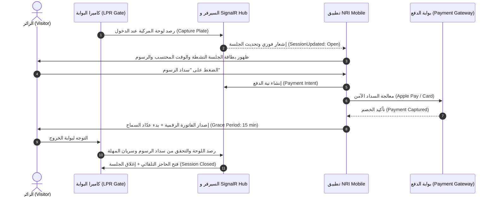
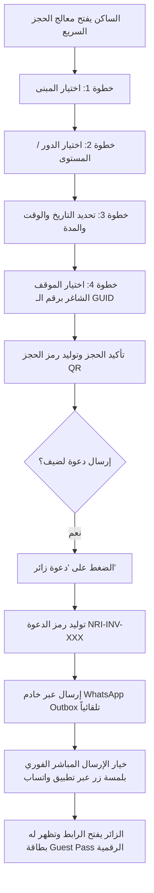
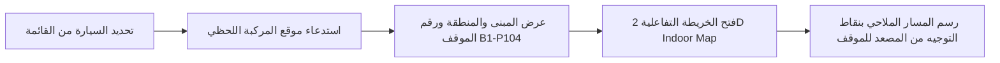

# 🏢 NRI Smart Community & Intelligent Parking Platform (Mobile)
> **تطبيق الجوال المتكامل لإدارة وتنقل مجتمع ومواقف حي NRI District الذكي**  
> مبني بأحدث معايير **Flutter 3.x** و **Clean Architecture** مع دعم كامل للوضعين **الداكن (Midnight Navy) والفاتح (Clean Ivory)**، وأنظمة المزامنة الحية **SignalR** وإشعارات **FCM Deep Links**.

---

## 📑 فهرس المحتويات (Table of Contents)
1. [🌟 الرؤية العامة ونظرة على المشروع (Executive Summary)](#1--الرؤية-العامة-ونظرة-على-المشروع-executive-summary)
2. [👥 أدوار المستخدمين وشخصيات النظام (User Personas & Roles)](#2--أدوار-المستخدمين-وشخصيات-النظام-user-personas--roles)
3. [🔄 دورات العمل والمسارات الكاملة (End-to-End Cycles & Architecture)](#3--دورات-العمل-والمسارات-الكاملة-end-to-end-cycles--architecture)
   - [دورة الزائر الذكية (LPR Entry to Exit Cycle)](#1-دورة-الزائر-الذكية-lpr-entry-to-exit-cycle)
   - [دورة الحجز ودعوة الضيوف (Reservation & Guest Pass Cycle)](#2-دورة-الحجز-ودعوة-الضيوف-reservation--guest-pass-cycle)
   - [دورة تحديد موقع السيارة والخريطة ثنائية الأبعاد (Find My Car & 2D Indoor Map)](#3-دورة-تحديد-موقع-السيارة-والخريطة-ثنائية-الأبعاد-find-my-car--2d-indoor-map)
   - [دورة الاشتراكات والباقات السكنية (Resident Subscriptions Cycle)](#4-دورة-الاشتراكات-والباقات-السكنية-resident-subscriptions-cycle)
   - [دورة العمليات والتحكم الميداني بالحواجز (Operations & Telemetry Cycle)](#5-دورة-العمليات-والتحكم-الميداني-بالحواجز-operations--telemetry-cycle)
4. [📸 دليل لقطات الشاشة للبرزنتيشن (Presentation & Screenshot Guide)](#4--دليل-لقطات-الشاشة-للبرزنتيشن-presentation--screenshot-guide)
5. [🏗️ البنية التحتية والتقنيات (Tech Stack & Architecture)](#5--البنية-التحتية-والتقنيات-tech-stack--architecture)
6. [🔐 الأمان والتوافق الذكي (Security & Deep Linking)](#6--الأمان-والتوافق-الذكي-security--deep-linking)
7. [🚀 التشغيل وسيناريوهات العرض (Run & Demo Guide)](#7--التشغيل-وسيناريوهات-العرض-run--demo-guide)

---

## 1. 🌟 الرؤية العامة ونظرة على المشروع (Executive Summary)

تطبيق **NRI Mobile** يمثل الواجهة المحمولة الذكية لحي **NRI Smart District**، حيث يحول تجربة المواقف التقليدية إلى منظومة رقمية متكاملة تعمل بدون أي تدخل بشري (Frictionless Experience):
- **التعرف التلقائي على اللوحات (LPR Cameras):** دخول وخروج المركبات تلقائياً عبر كاميرات القراءة الذكية للوحات.
- **التوجيه اللحظي (Real-time Telemetry):** عبر منصة خوادم الويب المتصلة بـ SignalR لعرض الإشغال المباشر، حالة الحواجز، ومواقع شواحن السيارات الكهربائية.
- **تخصيص كامل بحسب الدور (Role-Based Dynamic Dashboards):** شاشات رئيسية ومسارات مخصصة تتكيف تلقائياً بمجرد تسجيل الدخول لنوع الحساب (زائر، ساكن، موظف، مدير عمليات).
- **التصميم والهوية البصرية الراقية:** مطبق وفقاً لنظام **NRI Design Tokens** المعتمد، ومتوافق بالكامل بين الوضع الليلي والنهاري (Dark / Light Theme) باللغتين العربية والإنجليزية.

---

## 2. 👥 أدوار المستخدمين وشخصيات النظام (User Personas & Roles)

تطبيق واحد ذكي يتكيف ديناميكياً مع 4 أدوار رئيسية:

| الدور | الحساب التجريبي | الوصف والميزات المخصصة |
|---|---|---|
| **🚗 الزائر (Visitor)** | `visitor1` / `admin` | • متابعة الجلسة المفتوحة فور الدخول عبر الكاميرات.<br>• سداد الرسوم إلكترونياً (Credit Card / Apple Pay).<br>• تفعيل عدّاد مهلة السماح (15 دقيقة) وتوليد تصريح خروج QR.<br>• فحص وقبول دعوات الزيارة من السكان. |
| **🏡 الساكن (Citizen)** | `citizen1` / `admin` | • بطاقة الساكن الرقمية الدائمة (VIP Resident Pass).<br>• إدارة مركبات العائلة ولوحاتها.<br>• معالج حجز المواقف الذكي (4 خطوات لتحديد المبنى والدور والموقف).<br>• توليد ومشاركة تصاريح الضيوف عبر واتساب مباشرة.<br>• إدارة باقات الاشتراك المضمونة والاختيارية. |
| **🏢 الموظف (Employee)** | `employee1` / `admin` | • تصريح عمل مؤسسي نشط ومحدد بأوقات العمل الرسمية.<br>• توجيه مباشر لبوابة الموظفين والموقف المخصص.<br>• استعراض حالة شواحن المركبات الكهربائية وتذاكر الصيانة. |
| **🛡️ مدير العمليات (Admin)** | `admin1` / `admin` | • مركز قيادة العمليات الميدانية والتحكم المباشر.<br>• فتح وإغلاق الحواجز الذكية عن بُعد في حالات الطوارئ.<br>• رادار الإشغال الحي لجميع مباني ومناطق الحي الذكي.<br>• تشغيل سيناريو العرض التجريبي المتكامل (Demo Trigger). |

---

## 3. 🔄 دورات العمل والمسارات الكاملة (End-to-End Cycles & Architecture)

### (1) دورة الزائر الذكية (LPR Entry to Exit Cycle)
المسار بدون تذاكر ورقية: وصول السيارة للبوابة ← قراءة اللوحة ← بدء الجلسة ← الدفع الإلكتروني ← مهلة السماح ← الخروج التلقائي.



---

### (2) دورة الحجز ودعوة الضيوف (Reservation & Guest Pass Cycle)
المسار الذي يمكن الساكن من حجز موقف مسبق وإرسال رابط دعوة ذكي لضيفه مع إمكانية الإرسال المباشر عبر واتساب.



---

### (3) دورة تحديد موقع السيارة والخريطة ثنائية الأبعاد (Find My Car & 2D Indoor Map)
نظام التعرف الداخلي على مواقف المركبات لتمكين المستخدم من العثور على سيارته عبر مسار ملاحة داخلي تفاعلي.



---

### (4) دورة الاشتراكات والباقات السكنية (Resident Subscriptions Cycle)
إدارة تصاريح السكان والمواقف المحجوزة والباقات الشهرية:
1. استعراض حالة بطاقة الساكن **VIP Resident Pass**.
2. فحص تفاصيل الموقف المخصص برقم الدور والخانة (مثال: `Floor B1 - P-104`).
3. استعراض كتالوج الباقات المتاحة (**Parking Bundles Catalog**) مع تفاصيل السعر، والمناطق الرئيسية والمناطق الإضافية الاختيارية.
4. إمكانية الشراء والتفعيل التجريبي الفوري **(Demo Purchase)** مع تحديث الواجهة اللحظي.

---

### (5) دورة العمليات والتحكم الميداني بالحواجز (Operations & Telemetry Cycle)
مخصصة للموظفين ومديري التشغيل للمراقبة والتدخل السريع:
1. متابعة حالة الحواجز الذكية (4 بوابات متصلة).
2. متابعة كاميرات الـ LPR ومستشعرات الرصد الحي.
3. التحكم الفوري بالبوابات وفتح الطوارئ من التطبيق مباشرة عبر اتصال WebSocket مشفر.
4. لوحة الإشغال الموزعة لمتابعة السعة الشاغرة ونسب الامتلاء لكل مبنى ومنطقة.

---

## 4. 📸 دليل لقطات الشاشة للبرزنتيشن (Presentation & Screenshot Guide)

> **💡 نصيحة لفرق التقديم:**  
> لالتقاط سكرين شوتس بأعلى جودة واحترافية، يُفضل التقاطها في **الوضع الداكن (Dark Mode)** لإظهار الطابع التقني الحديث وتوهج التدرجات اللونية (Cyan Glow & Sky Blue Accent)، أو عمل مقارنة جنبًا إلى جنب (Side-by-Side) بين الوضعين الداكن والفاتح.

### 🖼️ خريطة السكرين شوتس المقترحة لشرائح العرض:

| # | اسم الشاشة / العنصر | المسار في الكود / Route | الحساب المقترح | ما الذي تبرزه في شريحة العرض؟ (Talking Point) |
|---|---|---|---|---|
| **01** | **شاشة الدخول (Login & Roles)** | `/login` | أي حساب | تصميم الدخول النظيف، والتبديل السريع بين الأدوار التجريبية (زائر، ساكن، موظف، مدير) بزر واحد. |
| **02** | **لوحة المدير / مركز العمليات** | `/home` | `admin` | إبراز هيرو **Operations Command Center** بلونه البنفسجي المضيء، وحالة الحواجز وكاميرات LPR المتصلة وأزرار التحكم الميداني. |
| **03** | **لوحة الساكن (Citizen Dashboard)** | `/home` | `citizen1` | إبراز بطاقة **VIP Resident Pass** الخضراء، والموقف المحجوز (`B1-A12`)، ومركبات العائلة، وزر دعوة الزائر. |
| **04** | **لوحة الزائر (Visitor Dashboard)** | `/home` | `visitor1` | إبراز بطاقة **تعرفة الزوار الذكية** الذهبية، وبانر الجلسة المفتوحة برقم اللوحة والمبلغ المستحق بالجنيه المصري. |
| **05** | **رادار ومؤشر الإشغال الحي** | `/occupancy` | الكل | استعراض **Occupancy Gauge** الدائري التفاعلي، ونسب الإشغال للمباني والمواقف مع مؤشر الشواغر اللحظي. |
| **06** | **شاشة الجلسة الحالية (Active Session)** | `/session` | `visitor1` | تفاصيل الدخول التلقائي: البوابة، وقت الدخول، رقم اللوحة، العداد المالي المباشر، وزر السداد الفوري. |
| **07** | **بوابة الدفع الإلكتروني (Payment Gateway)** | `/payment` | `visitor1` | خيارات الدفع الحديثة: Apple Pay والبطاقات الائتمانية، وشاشة المعالجة التفاعلية (Processing States). |
| **08** | **الفاتورة وعدّاد السماح (Grace Countdown)** | `/receipt` | `visitor1` | إيصال الدفع الإلكتروني المعتمد، ومؤشر الـ **15 دقيقة سماح** الدائري التنازلي للخروج من البوابة بدون رسوم إضافية. |
| **09** | **تصريح الدخول الرقمي (Digital QR Pass)** | `/pass` | `citizen1` أو بعد دفع الزائر | رمز الـ QR عالي الدقة القابل للمسح عند بوابات الدخول والخروج. |
| **10** | **أين سيارتي؟ (Find My Car)** | `/find-car/locate` | `citizen1` أو `visitor1` | تفاصيل مكان ركن السيارة: المبنى، الدور، رقم الموقف، مع زر الخريطة الداخلية. |
| **11** | **الخريطة الداخلية التفاعلية (2D Indoor Map)** | `/find-car/locate/map` | الكل | خريطة تفاعلية توضح المسار من المصعد إلى الموقف مع خطوط توجيه وأيقونات المصاعد والمشاة. |
| **12** | **معالج الحجز الذكي (Reservation Wizard)** | نافذة الحجز التفاعلية | `citizen1` | الـ 4 خطوات السلسة لاختيار المبنى، الدور، المدة، والموقف برقم GUID مخصص. |
| **13** | **تصريح الضيف وواتساب (Guest Pass & WhatsApp)** | `/guest-pass` | رابط الدعوة | بطاقة الضيف الذكية، وحالة تسليم رسالة الواتساب، وزر الإرسال المباشر بضغطة واحدة. |
| **14** | **باقات الاشتراكات (Subscription Bundles)** | `/subscription` | `citizen1` | كتالوج الباقات الشهرية، والمناطق المضمونة والاختيارية مع زر التفعيل التجريبي الفوري. |
| **15** | **شواحن السيارات الكهربائية (EV Hub)** | `/ev` | الكل | متابعة الشواحن المتاحة والمشغولة في كل مبنى في الوقت الفعلي. |
| **16** | **الملف الشخصي واللغات (Profile & Theme)** | `/profile` & `/language` | الكل | إدارة أسطول المركبات (إضافة/تعديل لوحة)، التبديل السلس بين العربية والإنجليزية، والوضع الليلي/النهاري. |

---

## 5. 🏗️ البنية التحتية والتقنيات (Tech Stack & Architecture)

```
┌────────────────────────────────────────────────────────┐
│                   NRI Mobile Client                    │
│   Flutter 3.x • Dart 3.x • Material 3 • Design System  │
└──────────────────────────┬─────────────────────────────┘
                           │
        ┌──────────────────┼──────────────────┐
        ▼                  ▼                  ▼
┌──────────────┐   ┌──────────────┐   ┌──────────────┐
│  State & DI  │   │  Networking  │   │  Real-time   │
│   Riverpod   │   │   Dio REST   │   │   SignalR    │
│AsyncNotifier │   │ Interceptors │   │ WebSocket Hub│
└──────────────┘   └──────────────┘   └──────────────┘
        │                  │                  │
        ▼                  ▼                  ▼
┌──────────────┐   ┌──────────────┐   ┌──────────────┐
│  Navigation  │   │ Security/FCM │   │ Localization │
│  GoRouter    │   │ Firebase Push│   │    Arabic    │
│  Deep Links  │   │Secure Storage│   │   English    │
└──────────────┘   └──────────────┘   └──────────────┘
```

### المكونات البرمجية الأساسية:
- **إدارة الحالة (State Management):** `flutter_riverpod` باستخدام معمارية `AsyncNotifier` لضمان تجاوب الواجهة، والتخزين المؤقت الذكي، وتحديث البيانات بسلاسة.
- **التوجيه والروابط العميقة (Navigation & Routing):** `go_router` مع دعم المسارات الديناميكية المشفرة للوحات العربية وروابط الإشعارات المباشرة.
- **الاتصال بالخادم (HTTP & REST):** `dio` مجهز بـ Interceptors للتوثيق (`Bearer Token`)، وتتبع معرّفات الارتباط (`X-Correlation-Id`)، والمعالجة المركزية للأخطاء (`ApiException`).
- **المزامنة الحية (Realtime Telemetry):** حزمة `signalr_netcore` للاتصال بـ Hub خادم المواقف `/hubs/parking` لمزامنة فتح الحواجز ورصد الجلسات فورياً.
- **التدويل واللغات (Internationalization):** `easy_localization` باللغتين العربية والإنجليزية مع مراعاة كاملة لاتجاه الشاشة (RTL / LTR).
- **التخزين الآمن (Security):** `flutter_secure_storage` لتشفير وحفظ رموز الجلسة (`access_token`, `refresh_token`).

---

## 6. 🔐 الأمان والتوافق الذكي (Security & Deep Linking)

1. **التعامل الآمن مع اللوحات العربية (Unicode-Safe Plate Routing):**  
   تم ابتكار دالة مخصصة `findCarLocation(plate)` لتمرير اللوحات العربية والمختلطة كـ Query Parameters مشفرة بدلاً من مسار الـ URL لتفادي أي أخطاء في فك التشفير:
   ```dart
   String findCarLocation(String plate, {bool map = false}) {
     final q = Uri(queryParameters: {'plate': plate}).query;
     if (map) return '/find-car/locate/map?$q';
     return '/find-car/locate?$q';
   }
   ```
2. **الحماية من هجمات التوجيه الخبيث (Deep Link Sanitization):**  
   نظام الإشعارات يفحص بدقة مسارات الروابط العميقة (FCM Payload)، ويتحقق من بنية الـ GUID وصحة المسار قبل التوجيه لمنع أي محاولات اختراق أو مسارات غير مصرح بها.
3. **طابور انتظار الروابط العميقة (Pending Deep Link Queue):**  
   في حال النقر على إشعار والتطبيق مغلق أو المستخدم غير مسجل، يتم حفظ الرابط في طابور انتظار آمن، ليتم توجيهه تلقائياً فور نجاح تسجيل الدخول.
4. **منع التكرار (Deduplication Engine):**  
   حماية النظام من تكرار الأحداث الصادرة بالتوازي من SignalR و FCM لنفس العملية عبر تتبع `notificationId`.

---

## 7. 🚀 التشغيل وسيناريوهات العرض (Run & Demo Guide)

### متطلبات التشغيل الأساسية:
- Flutter SDK (الإصدار 3.24 أو أحدث)
- Dart SDK (الإصدار 3.5 أو أحدث)
- بيئة تشغيل: محاكي Android أو iOS أو جهاز حقيقي

### خطوات التثبيت والتشغيل:
```bash
# 1. جلب الحزم والمكتبات
flutter pub get

# 2. فحص الكود والتأكد من خلوه من أي مشاكل
flutter analyze

# 3. تشغيل جميع اختبارات الوحدة والتحقق
flutter test

# 4. تشغيل التطبيق متصلاً بالسيرفر الحي
flutter run

# أو تشغيل التطبيق في وضع الـ Mock (بدون الحاجة لإنترنت أو سيرفر)
flutter run --dart-define=USE_MOCK=true
```

### جدول بيانات الدخول التجريبية (كلمة المرور لجميع الحسابات: `admin`):
```text
┌──────────────┬──────────────┬────────────────────────────────────────────────────────┐
│   Username   │     Role     │                  السيناريو المقترح للعرض               │
├──────────────┼──────────────┼────────────────────────────────────────────────────────┤
│ visitor1     │ الزائر       │ دخول البوابة -> جلسة مفتوحة -> سداد -> إيصال -> خروج   │
│ citizen1     │ الساكن       │ بطاقة VIP -> معالج الحجز -> دعوة ضيف عبر واتساب        │
│ employee1    │ الموظف       │ تصريح الدوام المؤسسي -> شواحن EV -> بلاغات الصيانة     │
│ admin        │ مدير العمليات│ لوحة القيادة -> فتح الحواجز الذكية -> رادار الإشغال    │
└──────────────┴──────────────┴────────────────────────────────────────────────────────┘
```

---

<div align="center">
  <sub>صُمم وطُوّر بأعلى معايير الجودة التقنية لحي NRI الذكي © 2026</sub>
</div>
